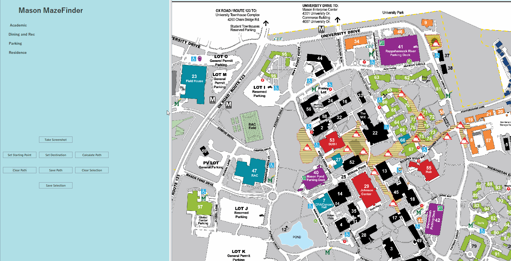
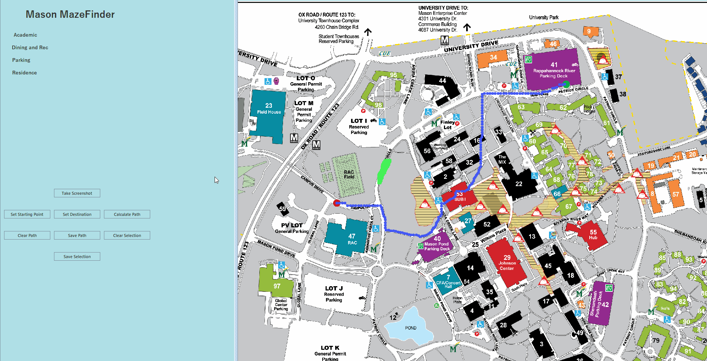
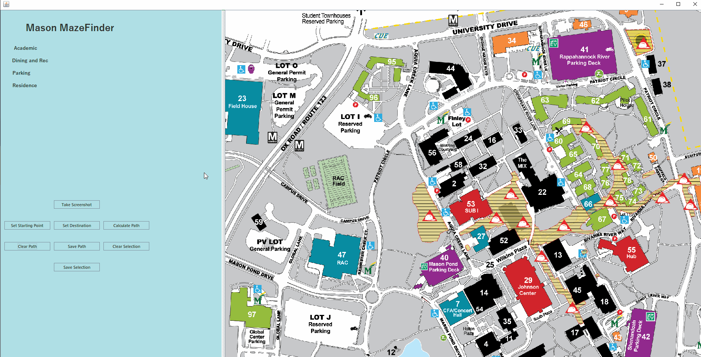

# Mason Maze Finder 
> This application helps the user (Students, Parents, and Visitors) to find the quickest route between user-specified points on the George Mason University Fairfax Campus, taking into account any user-specified "blockages" (commonly areas under construction).

---

## Table of Contents
- [What it does](#what-it-does)
- [What it uses](#what-it-uses)
- [Use it yourself](#use-it-yourself)
- [The Team](#the-team)

---

## What it does

> Map is fully explorable by left-clicking and dragging, as well as using the mouse wheel to zoom in and out of the map. 

 

> Plot a course from the parking garage to class, class to lunch, and back to your car again! Maximizing your time usage in between classes and after by cutting through buildings, and avoiding construction zones. 

| Use the dropdowns | Or place the start/end points manually |
|---|---|
|  |  |

 

> If new construction pops up, or you simply want to avoid a part of campus, just right-click and drag to create a `no-go zone`

 

> You don't have to worry about memorizing the route, or carrying around your laptop either, just take a screenshot!

 

> Lastly, have an unexpected shutdown? (Obviously our application didn't have a problem *wink*) Your `no-go zones` persist on reboot of the application!

---

## What it uses

> Languages: 
- **Java**

> Tools & Frameworks: 
- <a href="https://junit.org/">JUnit</a> (Testing Framework)
- <a href="http://hamcrest.org/JavaHamcrest/tutorial">Hamcrest</a> (Matcher Framework used with JUnit)
- <a href="http://jung.sourceforge.net/">Jung</a> (Java Universal Network/Graph Framework)
- <a href="http://www.jgoodies.com/">JGoodies</a> (Java Desktop GUI Library)

---

## Use it yourself

- Clone this repo to your local machine: `https://github.com/Chandler-Thompson/Mason-Maze-Finder.git`

---

## The Team:
> Inspired by the navigation difficulties imposed by the construction projects occurring on-campus.

| <a href="https://github.com/Chandler-Thompson/">**Richard C Thompson**</a> | <a href="https://github.com/Scusemua">**Ben Carver**</a> | <a href="https://github.com/poobear0803">**Poojah Rajamesh**</a> | <a href="https://github.com/ihaynes99">**Sam Haynes**</a> |
|---|---|---|---|
|  |  |  |  |
| <a href="https://github.com/Chandler-Thompson/" target="_blank">`github.com/Chandler-Thompson/`</a> | <a href="https://github.com/Scusemua/" target="_blank">`github.com/Scusemua/`</a> | <a href="https://github.com/poobear0803/" target="_blank">`github.com/poobear0803/`</a> | <a href="https://github.com/ihaynes99/" target="_blank">`github.com/ihaynes99/`</a> |

### Disclaimer:
This project is in no way supported or acknowledged by George Mason University. 
